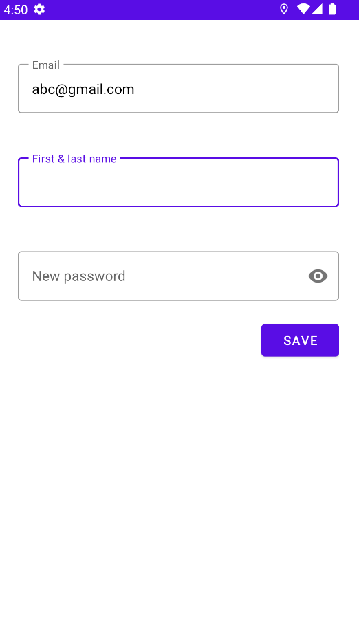
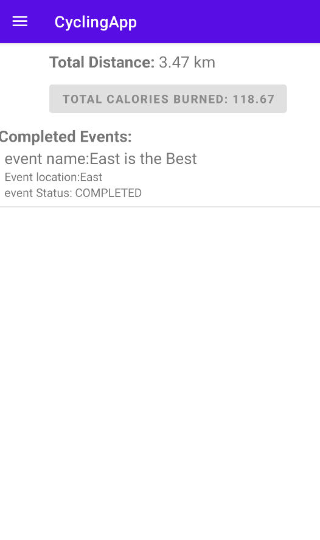

# Cycling App (Built with Android Studio(Java) and Firebase(FireStore))

**The Gobike app aims to support cyclists to search suitable cycling paths and other partners to exercise together. The app serves two main purposes: The first purpose is to allow users to find cycling paths that match their preferences. The location of the cycling paths will be provided to the user. The second purpose is to create social events for the cyclers to meet new people and join other cyclers. Details of the events such as the number of members and the gathering spot will be provided to the users.**

# App Sign in Page

- The user can choose to sign in or register with their email.
# Register Page
 
\
- The user will first need to register an account using thier email.
# Sign in Page
 
- If you already have an account registered, you will be redirected to the Sign in Page.
# Events Pages
 
 
- This is the page where you will see the list of available events. You can click the event and see the details.
# Create Event Page
 
- The user can set the date,time and route for the Cycling Event.
# Upcoming Event Page
 
 
- User can view the upcoming events and details in this page.
# Profile Pages
 
 
- The user can view the completed events, total distance travelled and calories burned in the profile page.
